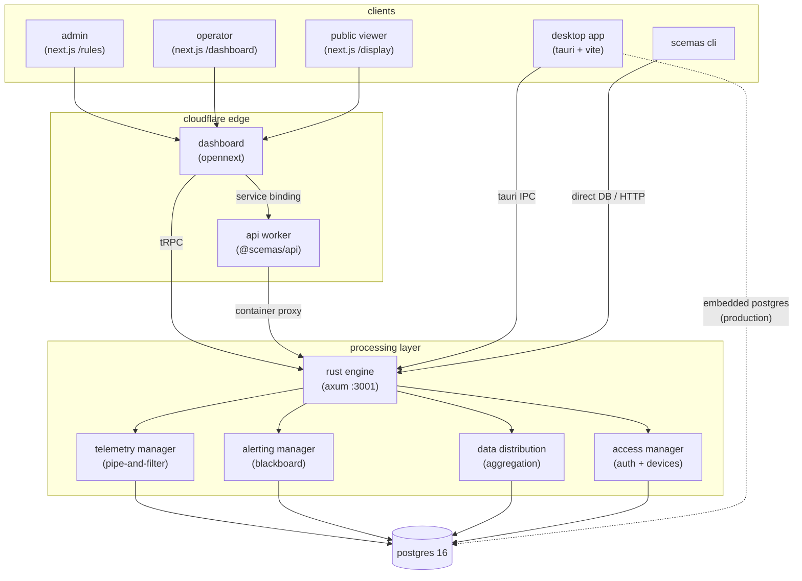
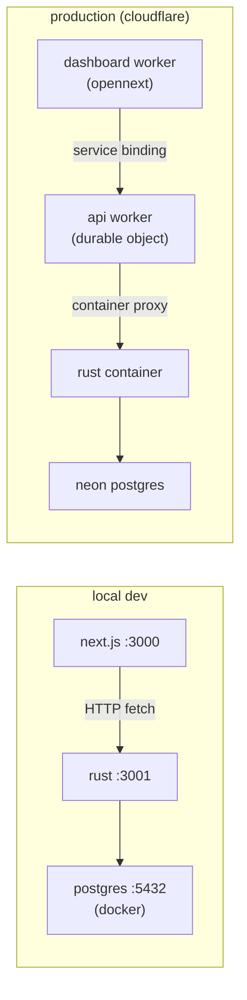
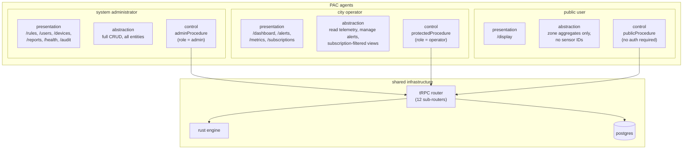
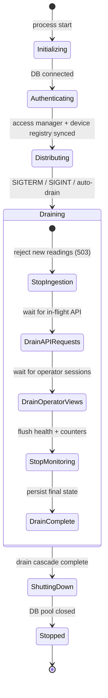
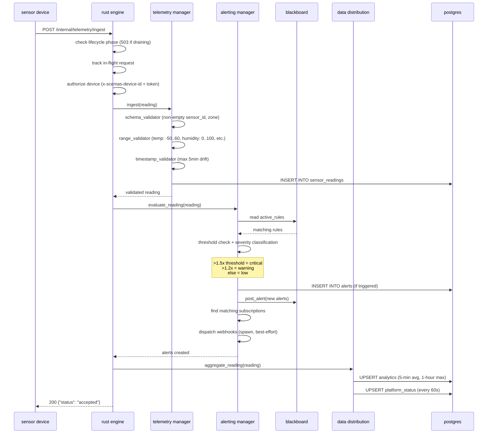
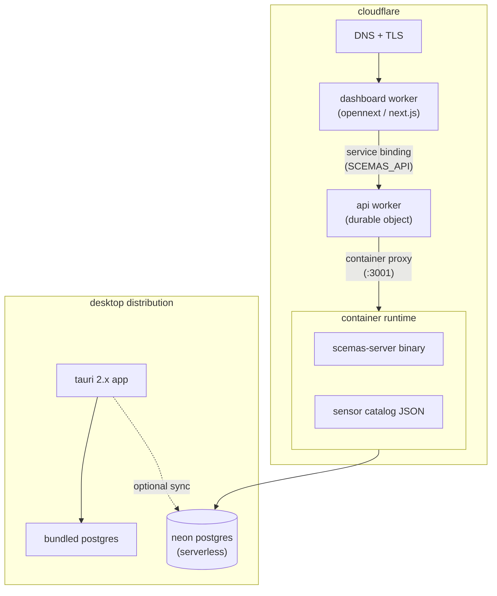

# system architecture

scemas-platform is a smart city environmental monitoring system for hamilton, ontario. it follows a **PAC (presentation-abstraction-control)** architecture with three user agents (admin, operator, public viewer), a rust processing engine, and postgres as the single source of truth.

## system topology



## local development vs production



locally it is two processes and a database. the next.js dev server on :3000 calls the rust engine on :3001 via HTTP. in production, cloudflare routes the dashboard through a worker service binding to the api worker, which manages a durable object container running the rust binary. the container auto-sleeps after 5 minutes of inactivity.

## PAC agent model

the system serves three distinct user agents, each with different data access and control surfaces.



| agent                | role       | landing page | can see                                               | can do                                                                    |
| -------------------- | ---------- | ------------ | ----------------------------------------------------- | ------------------------------------------------------------------------- |
| system administrator | `admin`    | `/rules`     | everything                                            | CRUD rules, manage users/devices, review hazard reports, view audit trail |
| city operator        | `operator` | `/dashboard` | telemetry, alerts (filtered by subscription), metrics | acknowledge/resolve alerts, update subscriptions, submit hazard reports   |
| public user          | `viewer`   | `/display`   | zone-level aggregates only (no raw sensor IDs)        | view AQI, rankings, zone history                                          |

the privacy boundary is enforced at the abstraction layer: `DataDistributionManager` strips sensor-level detail before returning data to public endpoints. operators see subscription-filtered alert lists. admins see everything.

## server lifecycle

the rust engine has a deterministic startup and shutdown sequence, tracked by atomic state.



each phase gate is an atomic `u8` check. requests track in-flight counts via `LifecycleState::track_request()` and auto-decrement on drop. the drain cascade polls every 50ms with a 30-second timeout per stage.

auto-drain triggers when the ingestion error rate exceeds 20% for 3 consecutive health snapshots (60 seconds each). this prevents a degraded system from silently corrupting data.

## data model

18 postgres tables, owned by drizzle schema, mirrored in rust (`scemas-core/models.rs`) and typescript (`@scemas/types/index.ts`).

```mermaid
erDiagram
    accounts ||--o{ activeSessionTokens : "has sessions"
    accounts ||--o{ apiTokens : "owns tokens"
    accounts ||--o{ alertSubscriptions : "subscribes"
    accounts ||--o{ auditLogs : "generates"
    accounts ||--o{ hazardReports : "reports/reviews"

    devices ||--o{ sensorReadings : "produces"

    thresholdRules ||--o{ alerts : "triggers"
    alerts }o--|| accounts : "acknowledged by"

    sensorReadings ||--o{ analytics : "aggregated into"
    sensorReadings ||--o{ ingestionFailures : "fails to"

    accounts {
        uuid id PK
        text email UK
        text username
        text passwordHash
        enum role
        timestamp createdAt
    }

    devices {
        text deviceId PK
        text deviceType
        text zone
        enum status
        timestamp registeredAt
    }

    sensorReadings {
        serial id PK
        text sensorId
        enum metricType
        numeric value
        text zone
        timestamp time
    }

    thresholdRules {
        uuid id PK
        enum metricType
        numeric thresholdValue
        enum comparison
        text zone
        enum ruleStatus
        uuid createdBy FK
    }

    alerts {
        uuid id PK
        uuid ruleId FK
        text sensorId
        int severity
        enum status
        numeric triggeredValue
        text zone
        enum metricType
        timestamp createdAt
    }

    analytics {
        serial id PK
        text zone
        enum metricType
        numeric aggregatedValue
        text aggregationType
        int sampleCount
        numeric sampleSum
        timestamp time
    }

    alertSubscriptions {
        uuid id PK
        uuid userId FK UK
        text_arr metricTypes
        text_arr zones
        int minSeverity
        text webhookUrl
    }

    platformStatus {
        serial id PK
        text subsystem
        text status
        numeric uptime
        numeric latencyMs
        numeric errorRate
        timestamp time
    }
```

supporting tables not shown: `ingestionCounters` (health counters per subsystem), `ingestionFailures` (dead-letter queue for failed readings), `auditLogs` (immutable action trail), `hazardReports` (user-submitted environmental incidents), `oauthClients`/`oauthCodes`/`oauthTokens` (RFC 7591 app registry), `rateLimitHits` (sliding-window rate limit tracking).

## request flow: sensor reading to alert

the most important data path. a sensor reading arrives, passes through validation, gets persisted, evaluated against rules, and potentially dispatches alerts.



if any validation filter rejects the reading, the pipeline short-circuits, records an `ingestion_failure`, and returns an error. alerting and aggregation failures are logged but don't fail the ingest (best-effort).

## deployment architecture



the api worker wraps the rust binary in a cloudflare container (durable object). it starts on first request, auto-sleeps after 5 minutes idle, and health-checks via `/internal/health`. the dashboard reaches it through a service binding (no public round-trip through `workers.dev`).

the desktop app bundles its own postgres binary for offline operation. when `SCEMAS_REMOTE_DB_URL` is set, a background sync service replicates data from the remote database.

## monitoring regions

11 monitoring zones mapped to hamilton, ontario neighborhoods. each zone has polygon boundaries derived from the City of Hamilton Neighborhoods feature service.

| zone ID                 | area                   |
| ----------------------- | ---------------------- |
| `downtown_core`         | downtown hamilton core |
| `north_end_west`        | north end (west)       |
| `north_end_east`        | north end (east)       |
| `kirkendall_chedoke`    | kirkendall / chedoke   |
| `beasley_landsdale`     | beasley / landsdale    |
| `central_south`         | central south          |
| `crown_point`           | crown point            |
| `east_hamilton`         | east hamilton          |
| `industrial_waterfront` | industrial waterfront  |
| `west_harbour`          | west harbour           |
| `strathcona`            | strathcona             |

zone definitions live in `scripts/generate-monitoring-network.ts`. derived assets: `data/hamilton-monitoring-regions.json`, `data/hamilton-sensor-catalog.json`, `data/regions.catalog.json`.
