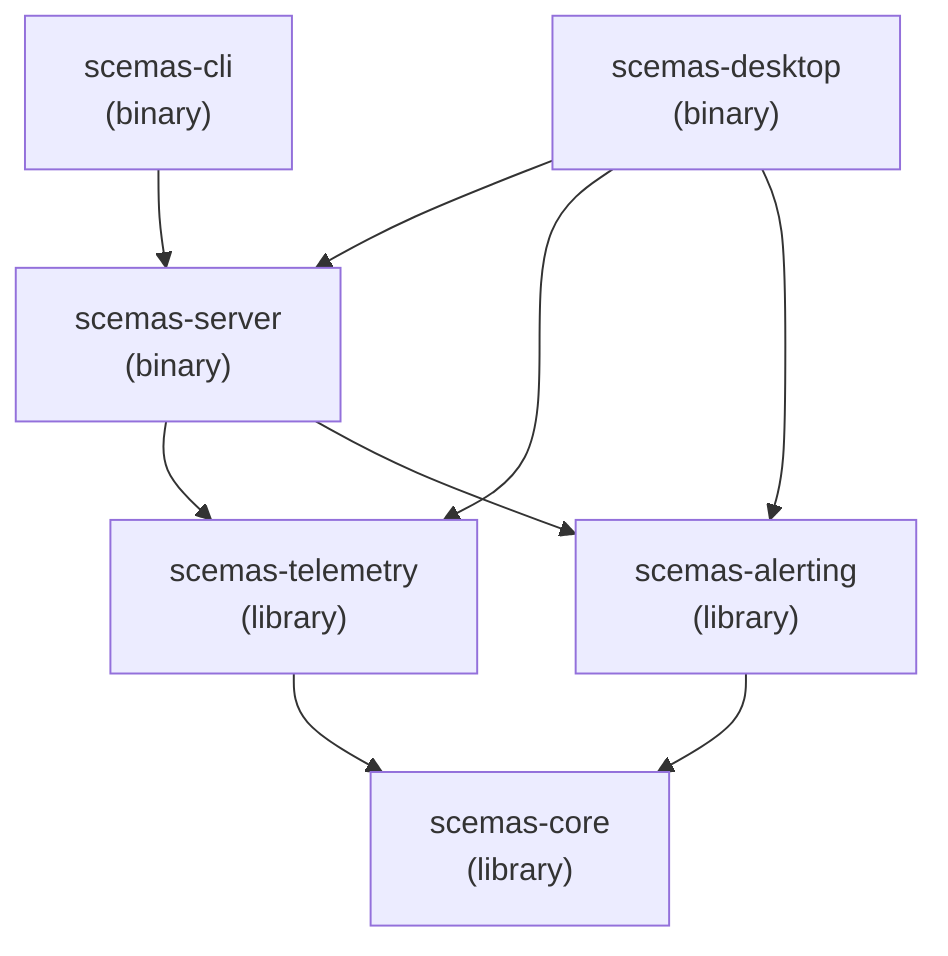
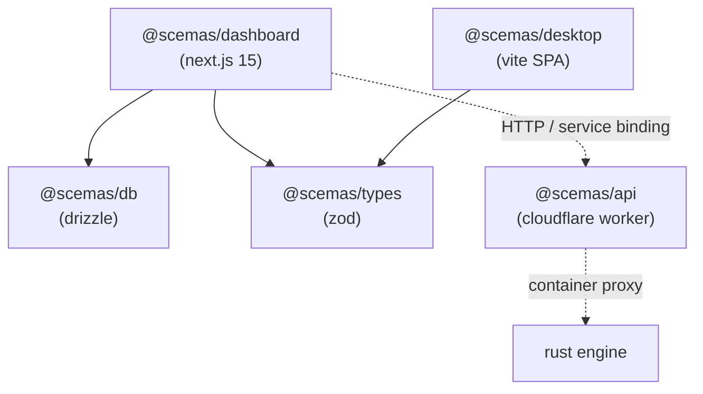
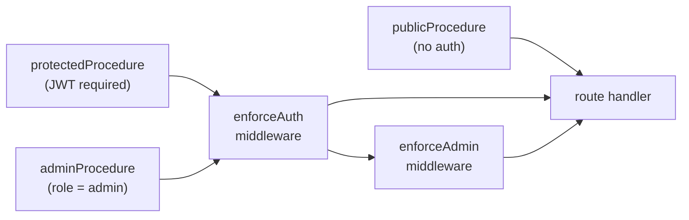
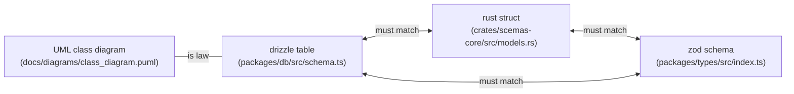

# codebase guide

where everything lives, what it does, and how the pieces connect. this is the document you read when you're staring at the repo for the first time and need to know which file to open.

## repo layout

```
scemas-platform/
├── crates/                         # rust workspace (6 crates)
│   ├── scemas-core/                # shared types, enums, lifecycle, errors
│   ├── scemas-telemetry/           # pipe-and-filter ingestion pipeline
│   ├── scemas-alerting/            # blackboard alert evaluation
│   ├── scemas-server/              # axum HTTP server (:3001)
│   ├── scemas-desktop/             # tauri 2.x desktop app
│   └── scemas-cli/                 # local development CLI
├── packages/                       # bun/typescript workspace (5 packages)
│   ├── db/                         # drizzle schema (database source of truth)
│   ├── types/                      # zod schemas + TS types
│   ├── api/                        # cloudflare worker (container proxy)
│   ├── dashboard/                  # next.js 15 + tRPC web app
│   └── desktop/                    # vite + react SPA for tauri
├── docs/                           # architecture, specs, runbooks
│   ├── diagrams/                   # PlantUML source files (11)
│   └── runbooks/                   # operational troubleshooting
├── data/                           # hamilton sensor catalog + region data
├── scripts/                        # dev tooling and data generation
├── .github/workflows/              # CI/CD (ci, deploy, desktop-sync-check)
├── docker-compose.yml              # local postgres
├── Dockerfile                      # rust server container build
└── flake.nix                       # nix dev environment
```

## rust crates

### dependency graph



### scemas-core

the foundation crate. no business logic, no IO, no database calls. just types and state.

| file               | what's in it                                                                                                                                                                                                                     |
| ------------------ | -------------------------------------------------------------------------------------------------------------------------------------------------------------------------------------------------------------------------------- |
| `src/models.rs`    | all entity structs: `UserInformation`, `ActiveSessionToken`, `DeviceIdentity`, `IndividualSensorReading`, `ThresholdRule`, `Alert`, `AnalyticsRecord`, `PlatformStatus`, `IngestionFailure`, `HazardReport`, `AlertSubscription` |
| `src/error.rs`     | `Error` enum (`Validation`, `NotFound`, `Unauthorized`, `Forbidden`, `Database`, `ServiceUnavailable`, `Internal`) with axum `IntoResponse`                                                                                      |
| `src/lifecycle.rs` | `ServerPhase` enum (6 states), `DrainStage` enum (6 stages), `LifecycleState` struct (lock-free atomics)                                                                                                                         |
| `src/config.rs`    | `Config` struct loaded from environment variables                                                                                                                                                                                |
| `src/regions.rs`   | zone ID normalization, zone filter matching, sensor-to-zone resolution                                                                                                                                                           |

key enums:

| enum           | variants                                        | used for                  |
| -------------- | ----------------------------------------------- | ------------------------- |
| `Role`         | operator, admin, viewer                         | access control            |
| `MetricType`   | temperature, humidity, air_quality, noise_level | sensor classification     |
| `Comparison`   | gt, lt, gte, lte                                | threshold rule operators  |
| `Severity`     | Low(1), Warning(2), Critical(3)                 | alert priority (i32 repr) |
| `AlertStatus`  | triggered, active, acknowledged, resolved       | alert lifecycle           |
| `DeviceStatus` | active, inactive, revoked                       | device registry           |

### scemas-telemetry

the ingestion pipeline. three filters, one controller.

| file                | purpose                                                                       |
| ------------------- | ----------------------------------------------------------------------------- |
| `src/validate.rs`   | `schema_validator`, `range_validator`, `timestamp_validator` (pure functions) |
| `src/ingest.rs`     | `parse_reading(json: &str)` JSON deserialization boundary                     |
| `src/controller.rs` | `TelemetryManager` orchestrates parse -> validate -> persist                  |
| `src/health.rs`     | `IngestionHealth` atomic counters (received, accepted, rejected)              |

### scemas-alerting

the blackboard system. shared state plus three knowledge sources.

| file                | purpose                                                                       |
| ------------------- | ----------------------------------------------------------------------------- |
| `src/blackboard.rs` | `Blackboard` struct (HashMap of rules + alerts), wrapped in `RwLock`          |
| `src/evaluator.rs`  | reads rules + reading, produces alerts. severity classification (ratio-based) |
| `src/dispatcher.rs` | matches alerts to subscriptions, fires webhooks                               |
| `src/lifecycle.rs`  | alert state machine (valid transitions only)                                  |
| `src/controller.rs` | `AlertingManager` orchestrates evaluation + dispatch, manages rule CRUD       |

### scemas-server

the HTTP layer. axum on port 3001, internal-only routes.

| file                  | purpose                                                               |
| --------------------- | --------------------------------------------------------------------- |
| `src/main.rs`         | tokio runtime, signal handling (SIGTERM/SIGINT), graceful shutdown    |
| `src/lib.rs`          | `ScemasRuntime` struct, init sequence, drain cascade                  |
| `src/state.rs`        | `AppState` (shared across handlers via axum state)                    |
| `src/routes.rs`       | 18 route handlers under `/internal/*`                                 |
| `src/distribution.rs` | `DataDistributionManager` (aggregation, health snapshots, auto-drain) |

route table:

| method | path                                          | handler                                      |
| ------ | --------------------------------------------- | -------------------------------------------- |
| POST   | `/internal/auth/signup`                       | account creation                             |
| POST   | `/internal/auth/login`                        | session creation                             |
| POST   | `/internal/auth/reset-password`               | password reset                               |
| POST   | `/internal/tokens`                            | API token generation                         |
| POST   | `/internal/devices/register`                  | device registration                          |
| POST   | `/internal/devices/{id}/update`               | device update                                |
| POST   | `/internal/devices/{id}/revoke`               | device revocation                            |
| POST   | `/internal/telemetry/ingest`                  | sensor reading ingestion (the main pipeline) |
| GET    | `/internal/health`                            | counters + lifecycle state                   |
| POST   | `/internal/alerting/rules`                    | rule creation                                |
| POST   | `/internal/alerting/rules/{id}/edit`          | rule editing                                 |
| POST   | `/internal/alerting/rules/{id}/status`        | rule activation/deactivation                 |
| POST   | `/internal/alerting/rules/{id}/delete`        | rule deletion                                |
| POST   | `/internal/alerting/alerts/{id}/acknowledge`  | alert acknowledgment                         |
| POST   | `/internal/alerting/alerts/{id}/resolve`      | alert resolution                             |
| POST   | `/internal/alerting/alerts/batch-resolve`     | bulk resolution                              |
| POST   | `/internal/alerting/alerts/batch-acknowledge` | bulk acknowledgment                          |

### scemas-desktop

tauri 2.x app with embedded postgres support.

| file                     | purpose                                                                                                         |
| ------------------------ | --------------------------------------------------------------------------------------------------------------- |
| `src/main.rs`            | tauri entry, postgres mode selection, runtime init, tray setup                                                  |
| `src/postgres.rs`        | `EmbeddedPostgres` (initdb, pg_ctl start/stop, schema application)                                              |
| `src/auth.rs`            | `RemoteAuth` client (cloudflare fallback for login/signup)                                                      |
| `src/commands/local.rs`  | 14 write commands (ingest, rules CRUD, alerts, subscriptions)                                                   |
| `src/commands/reads.rs`  | 23 read commands (pure sqlx queries)                                                                            |
| `src/commands/remote.rs` | 3 auth commands (login, signup, tray state)                                                                     |
| `src/queries/`           | 10 sqlx query modules (alerts, audit, devices, health, public, reports, rules, subscriptions, telemetry, users) |
| `src/sync.rs`            | background sync service (remote DB replication)                                                                 |
| `src/tray.rs`            | system tray with severity-colored icons                                                                         |
| `src/notifications.rs`   | native OS notifications on threshold breaches                                                                   |

the desktop app runs the same `ScemasRuntime` as the server. the difference: it can start its own postgres, handles auth locally first (falling back to remote), and exposes 40 IPC commands instead of HTTP routes.

### scemas-cli

local development orchestrator. the `scemas` binary.

| command                                           | what it does                                                   |
| ------------------------------------------------- | -------------------------------------------------------------- |
| `scemas dev` / `scemas dev up`                    | start postgres (docker) + apply schema + default accounts      |
| `scemas dev engine`                               | run rust engine (optionally with `--reload` for file watching) |
| `scemas dev dashboard`                            | run next.js dev server                                         |
| `scemas dev desktop`                              | full desktop orchestration (postgres + vite + tauri)           |
| `scemas dev seed`                                 | emit simulated telemetry data                                  |
| `scemas dev webhook`                              | run test webhook echo server                                   |
| `scemas dev check`                                | fmt + clippy + typecheck                                       |
| `scemas health`                                   | show ingestion counters + platform status                      |
| `scemas rules list/create/edit/set-status/delete` | manage threshold rules                                         |
| `scemas alerts list/acknowledge/resolve`          | manage alerts                                                  |
| `scemas tokens create`                            | generate API tokens                                            |
| `scemas completion bash/zsh/fish`                 | shell completions                                              |

---

## typescript packages

### dependency graph



### @scemas/db

the database schema. drizzle owns all table definitions, column types, indexes, and relationships. never create sqlx migrations.

| file                      | purpose                                                                                     |
| ------------------------- | ------------------------------------------------------------------------------------------- |
| `src/schema.ts`           | 18 table definitions with indexes and constraints                                           |
| `src/client.ts`           | `createDb()` (singleton for node.js) and `createDbWorker()` (request-scoped for cloudflare) |
| `src/index.ts`            | re-exports                                                                                  |
| `scripts/ensure-users.ts` | creates default accounts (admin, operator, viewer with password `1234`)                     |

the 18 tables: `accounts`, `devices`, `activeSessionTokens`, `sensorReadings`, `thresholdRules`, `alerts`, `auditLogs`, `alertSubscriptions`, `analytics`, `ingestionFailures`, `ingestionCounters`, `apiTokens`, `hazardReports`, `oauthClients`, `oauthCodes`, `oauthTokens`, `platformStatus`, `rateLimitHits`.

### @scemas/types

zod schemas that mirror drizzle tables and rust models. a single `src/index.ts` with 40+ schemas. used as tRPC input validators and response type generators.

the three-way mirror: drizzle table (schema.ts) <-> rust struct (models.rs) <-> zod schema (index.ts). field names must match across all three. rename everywhere or nowhere.

### @scemas/dashboard

next.js 15 with tRPC. the web frontend and API surface for all three PAC agents.

| directory                             | purpose                                                                                                                       |
| ------------------------------------- | ----------------------------------------------------------------------------------------------------------------------------- |
| `app/(auth)/`                         | sign-in, sign-up pages                                                                                                        |
| `app/(console)/`                      | admin + operator pages (dashboard, alerts, rules, users, devices, etc.)                                                       |
| `app/(public)/`                       | public display page                                                                                                           |
| `components/`                         | shared UI components                                                                                                          |
| `server/trpc.ts`                      | tRPC context creation, auth middleware (public, protected, admin)                                                             |
| `server/router.ts`                    | root router composing 12 sub-routers                                                                                          |
| `server/routers/`                     | individual routers (auth, telemetry, alerts, rules, subscriptions, users, devices, reports, public, health, audit, apiTokens) |
| `server/rust-client.ts`               | HTTP client for rust engine (service binding -> direct HTTP fallback)                                                         |
| `server/data-distribution-manager.ts` | aggregation queries + privacy boundary for public endpoints                                                                   |
| `middleware.ts`                       | JWT verification, role-based routing, CORS                                                                                    |

tRPC middleware stack:



role-based page routing:

| path                                                            | required role                   | redirect if wrong role               |
| --------------------------------------------------------------- | ------------------------------- | ------------------------------------ |
| `/rules`, `/users`, `/devices`, `/reports`, `/health`, `/audit` | admin                           | to role's landing page               |
| `/dashboard`, `/alerts`, `/metrics`, `/subscriptions`           | operator or admin               | viewer -> `/display`                 |
| `/display`                                                      | any (including unauthenticated) | -                                    |
| `/sign-in`, `/sign-up`                                          | none                            | if already logged in -> landing page |

### @scemas/api

cloudflare worker that wraps the rust binary in a durable object container. a single `src/worker.ts`. no business logic, purely transport.

flow: incoming request -> check required env vars -> get durable object -> start container (wait up to 60s) -> proxy request to `:3001` -> return response.

the container auto-sleeps after 5 minutes of no requests. it health-checks via `/internal/health`.

### @scemas/desktop

vite + react SPA for the tauri shell. same views as the dashboard, but components are duplicated (not shared) for independence.

| directory           | purpose                                                               |
| ------------------- | --------------------------------------------------------------------- |
| `src/pages/`        | login, dashboard, rules, display, etc.                                |
| `src/components/`   | duplicated dashboard components                                       |
| `src/hooks/`        | custom hooks                                                          |
| `src/store/auth.ts` | zustand auth state (syncs with tray icon)                             |
| `src/lib/tauri.ts`  | `useTauriQuery` / `useTauriMutation` (react query + tauri IPC bridge) |
| `src/router.tsx`    | TanStack Router with role-based guards                                |
| `src/layouts/`      | sidebar + header layout (conditional nav by role)                     |

the desktop communicates with the rust backend exclusively through tauri IPC (`invoke(command, args)`), not HTTP. the `useTauriQuery` hook wraps this in react query for caching and refetching.

---

## cross-layer entity consistency

the most important invariant in the codebase. every entity is defined in three places, and they must stay synchronized.



if you rename a field, you rename it in all four places. the UML class diagram is the source of truth for what entities exist and their relationships. drizzle is the source of truth for the actual database columns and indexes.

---

## configuration

### environment variables

| variable               | required | default                             | purpose                           |
| ---------------------- | -------- | ----------------------------------- | --------------------------------- |
| `DATABASE_URL`         | yes      | -                                   | postgres connection string        |
| `JWT_SECRET`           | yes      | -                                   | session token signing             |
| `DEVICE_AUTH_SECRET`   | yes      | -                                   | device registration token signing |
| `RUST_PORT`            | no       | 3001                                | rust engine port                  |
| `JWT_EXPIRY_HOURS`     | no       | 24                                  | session duration                  |
| `DEVICE_CATALOG_PATH`  | no       | `data/hamilton-sensor-catalog.json` | sensor catalog location           |
| `INTERNAL_RUST_URL`    | no       | `http://localhost:3001`             | dashboard -> rust engine URL      |
| `SCEMAS_REMOTE_DB_URL` | no       | -                                   | desktop remote sync target        |
| `SCEMAS_API_URL`       | no       | -                                   | CLI remote API target             |
| `SCEMAS_API_TOKEN`     | no       | -                                   | CLI remote auth token             |
| `RUST_LOG`             | no       | `info`                              | tracing filter directive          |

### default accounts

created automatically by `bun db:push` (which runs `ensure-users`).

| email                  | password | role     | landing page |
| ---------------------- | -------- | -------- | ------------ |
| `admin@example.com`    | `1234`   | admin    | `/rules`     |
| `operator@example.com` | `1234`   | operator | `/dashboard` |
| `viewer@example.com`   | `1234`   | viewer   | `/display`   |

---

## CI/CD

### ci.yml (every push + PR)

runs in parallel:

- **rust**: `cargo fmt --check` + `cargo clippy --all --all-features` + `cargo test` (excludes desktop crate)
- **typescript**: `bun install` + `bun run typecheck`

### deploy.yml (main branch)

path-based triggers:

- dashboard changes (`packages/dashboard/**`, `packages/db/**`, `packages/types/**`) -> opennext build + wrangler deploy
- API changes (`crates/**`, `Dockerfile`, `Cargo.*`) -> docker build + container deploy

### desktop-sync-check.yml (PRs)

checks if dashboard component/styling changes need desktop counterpart updates. comments on the PR if drift is detected.

---

## quick reference

| "i want to..."                   | look at...                                                                                                                |
| -------------------------------- | ------------------------------------------------------------------------------------------------------------------------- |
| understand the data model        | `packages/db/src/schema.ts` (tables), `crates/scemas-core/src/models.rs` (structs)                                        |
| add a new entity                 | UML diagram first, then schema.ts, then models.rs, then types/index.ts                                                    |
| add a new API route              | `crates/scemas-server/src/routes.rs` + tRPC router in `packages/dashboard/server/routers/`                                |
| add a desktop command            | `crates/scemas-desktop/src/commands/` + query in `src/queries/`                                                           |
| change validation rules          | `crates/scemas-telemetry/src/validate.rs`                                                                                 |
| change alert severity logic      | `crates/scemas-alerting/src/evaluator.rs`                                                                                 |
| understand the shutdown sequence | `crates/scemas-server/src/lib.rs` (`drain()` method)                                                                      |
| add a monitoring zone            | `scripts/generate-monitoring-network.ts` then regenerate assets                                                           |
| debug ingestion failures         | `/internal/health` endpoint, then `ingestion_failures` table, then runbooks                                               |
| run locally                      | `docker-compose up -d && bun install && bun db:push && cargo run -p scemas-server` + `bun --filter @scemas/dashboard dev` |
| run desktop                      | `scemas dev desktop` (or manually: `scemas dev up` + `cargo tauri dev`)                                                   |
