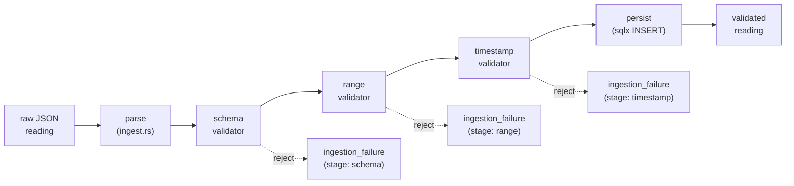
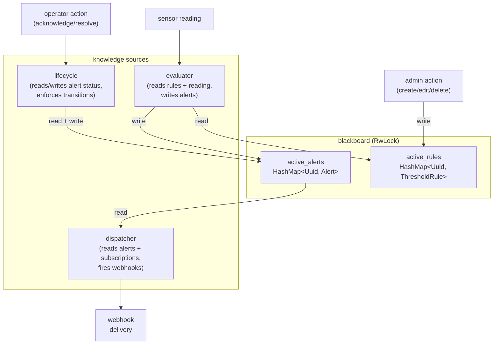
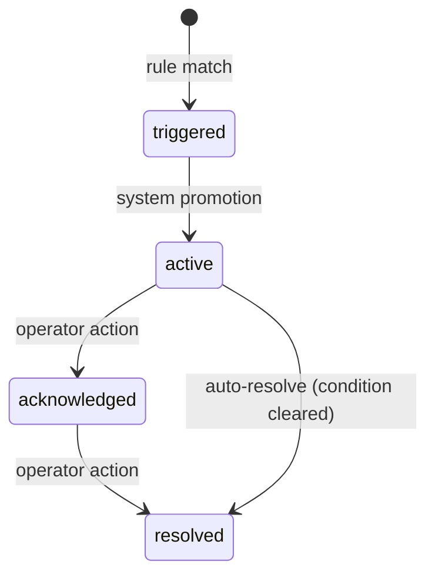
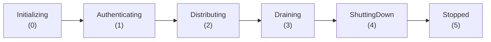
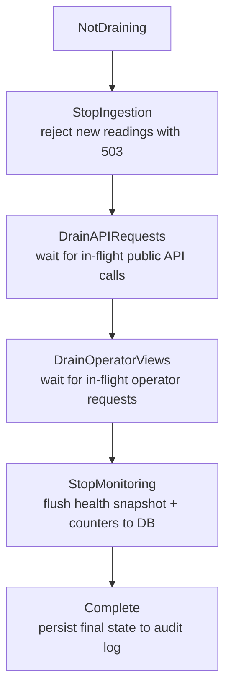
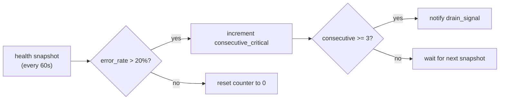

# architectural patterns

three SE patterns drive the system: pipe-and-filter (telemetry ingestion), blackboard (alert evaluation), and a lifecycle state machine (server coordination). this document explains each pattern's implementation in detail.

## pipe-and-filter: telemetry ingestion

the telemetry pipeline validates sensor readings through three sequential filters. each filter is a pure function that either passes the reading through or rejects it with a typed error. rejection at any stage short-circuits the pipeline.



### filter 1: schema validation

checks structural integrity. a reading must have non-empty `sensor_id` and `zone` fields. this catches malformed payloads before any domain logic runs.

```
fn schema_validator(reading) -> Result<Reading>:
    if reading.sensor_id is empty -> Err(Validation("sensor_id required"))
    if reading.zone is empty      -> Err(Validation("zone required"))
    Ok(reading)
```

### filter 2: range validation

checks physical plausibility per metric type. ranges come from real-world sensor specifications.

| metric type | min | max  | unit    |
| ----------- | --- | ---- | ------- |
| temperature | -50 | 60   | celsius |
| humidity    | 0   | 100  | percent |
| air_quality | 0   | 1000 | ug/m3   |
| noise_level | 0   | 194  | dB      |

194 dB is the theoretical maximum for a sound wave in earth's atmosphere (above this, you get a shock wave). the temperature range covers inhabited-city scenarios from extreme cold to desert heat.

```
fn range_validator(reading) -> Result<Reading>:
    let (min, max) = range_for(reading.metric_type)
    if reading.value < min or reading.value > max ->
        Err(Validation("value {v} outside [{min}, {max}]"))
    Ok(reading)
```

### filter 3: timestamp validation

rejects readings with timestamps more than 5 minutes from server time. this prevents replay attacks and catches sensors with drifted clocks.

```
fn timestamp_validator(reading) -> Result<Reading>:
    let drift = abs(now() - reading.timestamp)
    if drift > 5 minutes ->
        Err(Validation("timestamp drift {drift}s exceeds 300s"))
    Ok(reading)
```

### health tracking

an `IngestionHealth` struct tracks three atomic counters: `total_received`, `total_accepted`, `total_rejected`. these feed into `platform_status` snapshots every 60 seconds and drive the auto-drain trigger when the rejection ratio exceeds 20%.

### where it lives

| component                          | file                                                    |
| ---------------------------------- | ------------------------------------------------------- |
| filter functions                   | `crates/scemas-telemetry/src/validate.rs`               |
| JSON parsing boundary              | `crates/scemas-telemetry/src/ingest.rs`                 |
| controller (orchestrates pipeline) | `crates/scemas-telemetry/src/controller.rs`             |
| health counters                    | `crates/scemas-telemetry/src/health.rs`                 |
| route handler (calls controller)   | `crates/scemas-server/src/routes.rs` (ingest_telemetry) |

---

## blackboard: alert evaluation

the alerting system uses the blackboard pattern: a shared mutable data structure (`Blackboard`) coordinated by three independent knowledge sources that read and write to it.



### knowledge source 1: evaluator

takes a sensor reading and the current rule set, produces zero or more alerts.

```
fn evaluate(reading, rules) -> Vec<Alert>:
    for rule in rules:
        if rule.metric_type != reading.metric_type -> skip
        if rule.zone exists and !zone_matches(rule.zone, reading) -> skip
        if !threshold_exceeded(rule, reading) -> skip
        alerts.push(create_alert(rule, reading))
    return alerts
```

threshold check uses the rule's comparison operator:

| comparison | check                                   |
| ---------- | --------------------------------------- |
| `gt`       | `reading.value > rule.threshold_value`  |
| `lt`       | `reading.value < rule.threshold_value`  |
| `gte`      | `reading.value >= rule.threshold_value` |
| `lte`      | `reading.value <= rule.threshold_value` |

severity classification is ratio-based:

```
fn classify_severity(rule, reading) -> Severity:
    ratio = reading.value / rule.threshold_value
    if ratio > 1.5 -> Critical (3)
    if ratio > 1.2 -> Warning (2)
    else           -> Low (1)
```

a temperature rule with threshold 35C would classify a 53C reading as critical (53/35 = 1.51), a 42C reading as warning (42/35 = 1.2), and a 36C reading as low.

deduplication happens on `(sensor_id, metric_type, zone)`. the evaluator won't create a duplicate alert if one already exists in the blackboard's active set for the same combination.

### knowledge source 2: dispatcher

matches triggered alerts against user subscriptions, then fires webhooks.

```
fn matches_subscription(alert, subscription) -> bool:
    if alert.severity < subscription.min_severity -> false
    if subscription.metric_types not empty
       and alert.metric_type not in subscription.metric_types -> false
    if subscription.zones not empty
       and alert.zone not matching subscription.zones -> false
    true
```

webhook delivery is fire-and-forget (`tokio::spawn`). failures are logged but don't block the pipeline.

### knowledge source 3: lifecycle

enforces the alert state machine. only valid transitions are allowed.



invalid transitions (e.g., `triggered -> resolved` or `resolved -> active`) return an error.

### blackboard concurrency

the `Blackboard` struct is wrapped in `RwLock<Blackboard>`. reads (evaluation, dispatch) take a read lock. writes (posting alerts, updating status, replacing rules) take a write lock. this means evaluation can run concurrently across multiple readings, but rule updates block evaluation briefly.

the blackboard is process-local. horizontal scaling would require a shared coordination mechanism (e.g., postgres-backed outbox pattern).

### where it lives

| component                    | file                                       |
| ---------------------------- | ------------------------------------------ |
| blackboard struct            | `crates/scemas-alerting/src/blackboard.rs` |
| evaluator                    | `crates/scemas-alerting/src/evaluator.rs`  |
| dispatcher                   | `crates/scemas-alerting/src/dispatcher.rs` |
| alert state transitions      | `crates/scemas-alerting/src/lifecycle.rs`  |
| controller (orchestrates KS) | `crates/scemas-alerting/src/controller.rs` |

---

## lifecycle state machine: server coordination

the server lifecycle coordinates startup, steady-state operation, and graceful shutdown across all subsystems.

### phases



| phase          | what happens                              | what's accepted        |
| -------------- | ----------------------------------------- | ---------------------- |
| Initializing   | DB connection, config load                | nothing                |
| Authenticating | access manager init, device registry sync | nothing                |
| Distributing   | steady state, all systems active          | everything             |
| Draining       | cascaded shutdown (see below)             | depends on drain stage |
| ShuttingDown   | DB pool closing                           | nothing                |
| Stopped        | process exit                              | nothing                |

### drain cascade

draining is not instant. it progresses through five substages to ensure no data is lost.



each stage waits for the in-flight request counter to reach zero, polling every 50ms with a 30-second timeout. if the timeout expires, the system logs a warning and proceeds (better to lose a few in-flight requests than hang forever).

### lock-free implementation

the lifecycle uses `AtomicU8` for phase and drain stage, `AtomicU32` for in-flight request count. no mutexes. the pattern:

```
struct LifecycleState {
    phase: Arc<AtomicU8>,
    drain_stage: Arc<AtomicU8>,
    inflight: Arc<AtomicU32>,
}
```

request tracking uses RAII guards:

```
// on request entry
state.lifecycle.track_request()  // inflight.fetch_add(1)

// on request exit (drop guard)
state.lifecycle.release_request()  // inflight.fetch_sub(1)
```

### auto-drain trigger

`DataDistributionManager` records health snapshots every 60 seconds. if the ingestion error rate exceeds 20% for 3 consecutive snapshots (roughly 3 minutes of sustained failure), it sends a drain signal via `tokio::sync::Notify`. the server's graceful shutdown handler picks this up alongside SIGTERM/SIGINT.



### where it lives

| component                      | file                                       |
| ------------------------------ | ------------------------------------------ |
| ServerPhase + DrainStage enums | `crates/scemas-core/src/lifecycle.rs`      |
| LifecycleState (atomics)       | `crates/scemas-core/src/lifecycle.rs`      |
| ScemasRuntime (init + drain)   | `crates/scemas-server/src/lib.rs`          |
| auto-drain logic               | `crates/scemas-server/src/distribution.rs` |
| shutdown signal handler        | `crates/scemas-server/src/main.rs`         |

---

## data distribution: aggregation and privacy

`DataDistributionManager` sits between raw sensor data and what users see. it computes time-bucketed aggregates and enforces the privacy boundary for public endpoints.

### aggregation

every accepted reading triggers two upserts:

1. **5-minute average**: `UPSERT INTO analytics (zone, metric_type, aggregation_type='5m_avg', time=truncate_5min(now))` with running `sample_count` and `sample_sum`. the `aggregated_value` is `sample_sum / sample_count`.

2. **1-hour max**: same pattern but `aggregation_type='1h_max'` and `aggregated_value = max(existing, reading.value)`.

### privacy boundary

public endpoints return zone-level aggregates only. the abstraction layer:

- strips `sensor_id` from all responses
- returns AQI labels (`good`, `moderate`, `unhealthy`) instead of raw ug/m3 values
- provides rankings (`top N zones by metric`) without individual sensor breakdown
- includes `freshnessSeconds` so viewers know how stale the data is

### health monitoring

every 60 seconds (during ingestion), the manager snapshots:

- total received / accepted / rejected counts
- system uptime
- average ingestion latency (ms)
- error rate (rejected / received)

this feeds `platform_status` rows and drives the auto-drain trigger.
